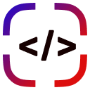

# Install

[Install extension from Chrome Web Store](https://chrome.google.com/webstore/detail/locatorjs/npbfdllefekhdplbkdigpncggmojpefi) (works for Chrome, Brave, Opera and Edge)

[Install extension from Firefox Add-ons](https://addons.mozilla.org/cs/firefox/addon/locatorjs/)

# Requirements

**Extension should work automatically dev mode in all modern stacks** (NextJS, Create React App, Vite, etc).
They automatically include [babel-preset-react](https://babeljs.io/docs/en/babel-preset-react) which includes [babel-plugin-transform-react-jsx-source](https://babeljs.io/docs/en/babel-plugin-transform-react-jsx-source). Non-babel stacks use similar alternatives.
If you don't have [babel-plugin-transform-react-jsx-source](https://babeljs.io/docs/en/babel-plugin-transform-react-jsx-source), you should set it up manually.

# Troubleshooting

If LocatorJS is not working, please check the following:

- **Make sure you are running your project in development mode.**
- If you have **custom webpack config or anything using Babel** make sure you have [babel-preset-react](https://babeljs.io/docs/en/babel-preset-react) preset or [babel-plugin-transform-react-jsx-source](https://babeljs.io/docs/en/babel-plugin-transform-react-jsx-source) plugin.
- You may check `process.env.NODE_ENV` if it is `development`

# Run extension locally

run `yarn dev` for development.
run `yarn build` to build the extension.

# Contributing

To develop of contribute to this project [continue here](./../../contributig.md)
