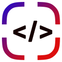

# Install

[Install extension from Chrome Web Store](https://chrome.google.com/webstore/detail/locatorjs/npbfdllefekhdplbkdigpncggmojpefi) (works for Chrome, Brave, Opera and Edge)

[Install extension from Firefox Add-ons](https://addons.mozilla.org/cs/firefox/addon/locatorjs/)

# Requirements

**Extension should work automatically dev mode in all modern stacks** (NextJS, Create React App, Vite, etc).
They automatically include [babel-preset-react](https://babeljs.io/docs/en/babel-preset-react) which includes [babel-plugin-transform-react-jsx-source](https://babeljs.io/docs/en/babel-plugin-transform-react-jsx-source). Non-babel stacks use similar alternatives.
If you don't have [babel-plugin-transform-react-jsx-source](https://babeljs.io/docs/en/babel-plugin-transform-react-jsx-source), you should set it up manually.

# Troubleshooting

## Broken source info

It doesn't show any "bouding boxes" when holding alt/option and moving mouse on the page. (plus you might see error in extension's Popup)

- **Make sure you are running your project in development mode.**
- If you have **custom webpack config or anything using Babel** make sure you have [babel-preset-react](https://babeljs.io/docs/en/babel-preset-react) preset or [babel-plugin-transform-react-jsx-source](https://babeljs.io/docs/en/babel-plugin-transform-react-jsx-source) plugin.
- You may check `process.env.NODE_ENV` if it is `development`

## Broken links

When I click on a component's bounding box, it doesn't go to editor

- It is possible that your editor doesn't have registered URL handler. Check browser console for errors. If you get something like `Failed to launch 'vscode://...24:11' because the scheme does not have a registered handler.`, try reinstalling your editor.

## Debug Mode

If source locations are incorrect or navigation fails, enable Debug Mode to troubleshoot:

### How to enable

1. **Settings panel** (recommended): Click the LocatorJS icon, open settings, and toggle "Debug Mode" on
2. **Console command**: `window.__LOCATORJS_DEBUG__ = true` or `enableLocatorDebug()`

### Console output

When enabled, clicking an element will log resolution details to the console:

```
[LocatorJS] Starting source resolution
  Fiber: <div> (tag: 5)
  DOM element: <div class="xxx">...</div>

[LocatorJS] [sync] Source found
  Method: fiber._debugSource
  Component: <div>
  Location: /app/page.tsx:15:0

[LocatorJS] Location complete
  Final method: fiber._debugSource
  Target location: /app/page.tsx:15:0
```

### Supported resolution methods

| Type | Methods |
|------|---------|
| Sync | `fiber._debugSource`, `elementType._source`, `type._source`, `memoizedProps.__source`, `_debugInfo` |
| Async | `rendererInterfaces API` (React DevTools 7.0.1+), `Turbopack chunk`, `source-map` reverse lookup |

### View debug history

```javascript
window.__LOCATORJS_DEBUG_HISTORY__
```

# Development

## Run extension locally

```bash
# Development mode (Chrome)
pnpm dev

# Development mode (Firefox)
pnpm dev:firefox
```

## Build & Release

### Using Node script (recommended)

```bash
# Package Chrome version (builds deps + extension + zip)
pnpm run release:node

# Package Firefox version
pnpm run release:node:firefox

# Package all versions
pnpm run release:node:all

# Skip dependency build (re-package extension only)
node utils/release.js --skip-runtime
```

### Step-by-step build

```bash
# 1. Build dependency packages (in order)
cd ../../packages/shared && pnpm build && cd -
cd ../../packages/runtime && pnpm build && cd -

# 2. Build extension
pnpm build              # Chrome
pnpm build:firefox      # Firefox

# 3. Package zip
pnpm pack:chrome        # -> build/chrome.zip
pnpm pack:firefox       # -> build/artifacts_firefox/
```

### Build notes

- **Package build order**: `shared` -> `runtime` -> `extension`
- After modifying `shared` type definitions, rebuild `shared` first, then `runtime`
- TypeScript type errors may occur if dependency packages haven't been rebuilt; the actual build will work correctly

### Build output

| Version | Build directory | Package file |
|---------|----------------|--------------|
| Chrome | `build/production_chrome/` | `build/chrome.zip` |
| Firefox | `build/production_firefox/` | `build/artifacts_firefox/*.zip` |

## Load unpacked extension

**Chrome:**
1. Open `chrome://extensions/`
2. Enable "Developer mode"
3. Click "Load unpacked"
4. Select the `build/production_chrome` directory

**Firefox:**
1. Open `about:debugging#/runtime/this-firefox`
2. Click "Load Temporary Add-on"
3. Select `build/production_firefox/manifest.json`

# Contributing

To develop of contribute to this project [continue here](./../../contributing.md)
